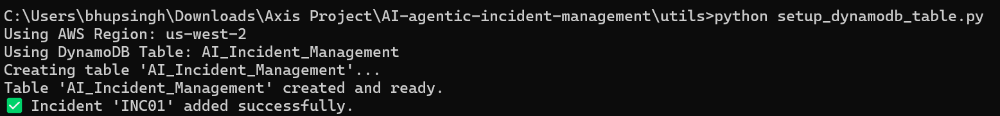

# Agentic Incident Management System
Semi-autonomous incident management system using AWS Lambda and Step Functions, built for Deloitte AWS AgentX Hackathon.

## Overview

This project is a semi-autonomous incident management solution developed for Deloitte’s AWS AgentX Hackathon. It automates the entire incident lifecycle, from initial diagnosis and escalation to resolution, communication, closure, and post-incident review.

Built with AWS Lambda and Step Functions, this serverless solution aims to reduce resolution time and improve incident handling efficiency. Optional integration with Amazon Bedrock enables advanced AI-driven diagnosis and resolution suggestions.

## Features

- Automated diagnosis of incidents  
- Severity-based escalation  
- Suggested resolution steps  
- Automated communication with stakeholders  
- Incident closure automation  
- Post-incident summary generation  

## Architecture & Technologies

- AWS Lambda (microservices for each step)  
- AWS Step Functions (workflow orchestration)  
- Amazon Bedrock (optional AI/ML for enhanced diagnosis)  
- Amazon CloudWatch (logging and monitoring)  

## Project Structure

/project-root
│
├── /utils/               # Common code
│   ├── dynamodb.py
│   ├── logger.py
│   └── setup_dynamodb_table.py # db create table n all
├── /agents/
│ ├── diagnosis.js
│ ├── diagnosis.txt
│ ├── escalation.js
│ ├── escalation.txt
│ ├── resolution.js
│ ├── resolution.txt
│ ├── communication.js
│ ├── communication.txt
│ ├── closure.js
│ ├── closure.txt
│ └── postReview.js
│ └── postReview.txt
└── .env
└── app.py    # main file  
└── app.txt    
└── architecture.txt  
└── README.md
└── .gitignore   
├── index.html

## Getting Started

1. Deploy each Lambda function on AWS Lambda.  
2. Configure AWS Step Functions to orchestrate the workflow between Lambdas.  
3. Use the sample input JSON to trigger the workflow and test functionality.  
4. Monitor execution via AWS CloudWatch logs and Step Functions console.  

## Sample Input JSON
{
  "incidentId": "INC00123",
  "description": "User unable to access the banking portal",
  "reportedBy": "john.doe@example.com",
  "timestamp": "2025-05-16T10:20:30Z"
}

## Sample Output JSON
{
  "incidentId": "INC00123",
  "issueType": "Authentication Error",
  "severity": "High",
  "escalatedTo": "L2 Support",
  "suggestedFix": "Reset user password and clear cache",
  "messageSent": true,
  "status": "Resolved",
  "postReview": "Issue resolved in 12 minutes; recommend monitoring auth service logs."
}

## Future Enhancements
 - Integrate Amazon Bedrock for AI-powered insights.
 - Add multi-channel notifications (Slack, SMS).
 - Build a web dashboard for real-time incident tracking and analytics.

## Install and Run Command
 - Install COmmand : pip install -r requirements.txt
 - RUN Command : python app.py --host=0.0.0.0
 - python setup_dynamodb_table.py  ::: Run Script to create the table
 

## Team
 - Bhupendra Singh
 - Tech Lead/ Backend Developer